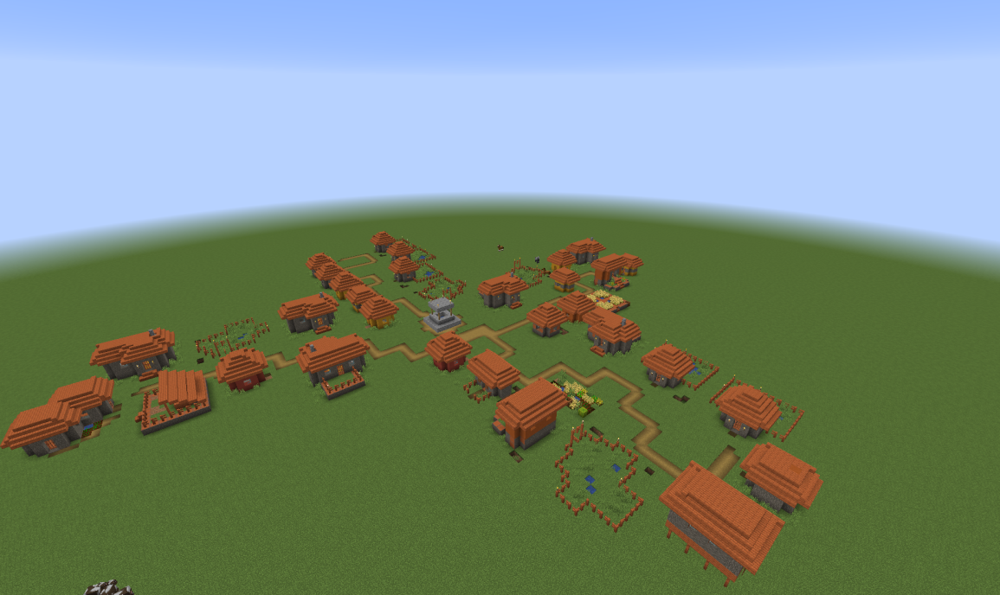

# GDMC - Project Code

## Adley Wong, Ben Cornel, Deon Lillo, Martin Jiang
## Cal Poly CSC 570 - Professor Rodrigo Cannan
---
## Requirements
The code requires the use of minecraft data files, particularly the `village` nbt files that are packaged with Minecraft.jar. Provided the EULA, we cannot provide explicitly the files within the repository. The steps to retrieve those files are provided.

1. Download the server.jar [here](https://launcher.mojang.com/v1/objects/1b557e7b033b583cd9f66746b7a9ab1ec1673ced/server.jar)
2. Unzip the server.jar file with your preferred unarchiver
3. Open the folder and search for data folder
4. In the folder should contain the directory `minecraft`
5. In that folder has a directory `structure`
6. Finally, `village` directory can be spotted in the folder, we will need this for the code
7. move or copy `village` into the working directory and rename the folder to `villages`


This ensures that the code will know where the provided NBT files are located

---
## Installation
```
> pip install -r requirements.txt
```

## Run
```
> python buildVillage.py
```
---

## Results

### Randomly generated buildings




### Heightmap and mask visualization


---
## Resources
+ [GDPC 5.0 (Manicule)](https://github.com/nilsgawlik/gdmc_http_client_python)
+ 
